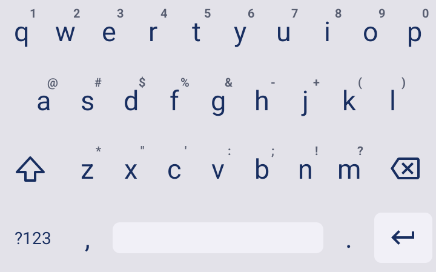

# keys, ink

A minimal keyboard for e-ink devices. Fork of [Simple Keyboard](https://github.com/rkkr/simple-keyboard).

## About

Features:
- E-ink optimized theme: pure B&W, no animations, bold borders on press
- Small size (<1MB)
- Adjustable keyboard height for more screen space
- Number row
- Swipe space to move pointer
- Delete swipe
- Custom theme colors
- Minimal permissions (only Vibrate)
- Ads-free

Feature it doesn't have and probably will never have:
- Emojis
- GIFs
- Spell checker
- Swipe typing

## Credits

Licensed under Apache License Version 2

Based on AOSP LatinIME keyboard. Original source: https://android.googlesource.com/platform/packages/inputmethods/LatinIME/
